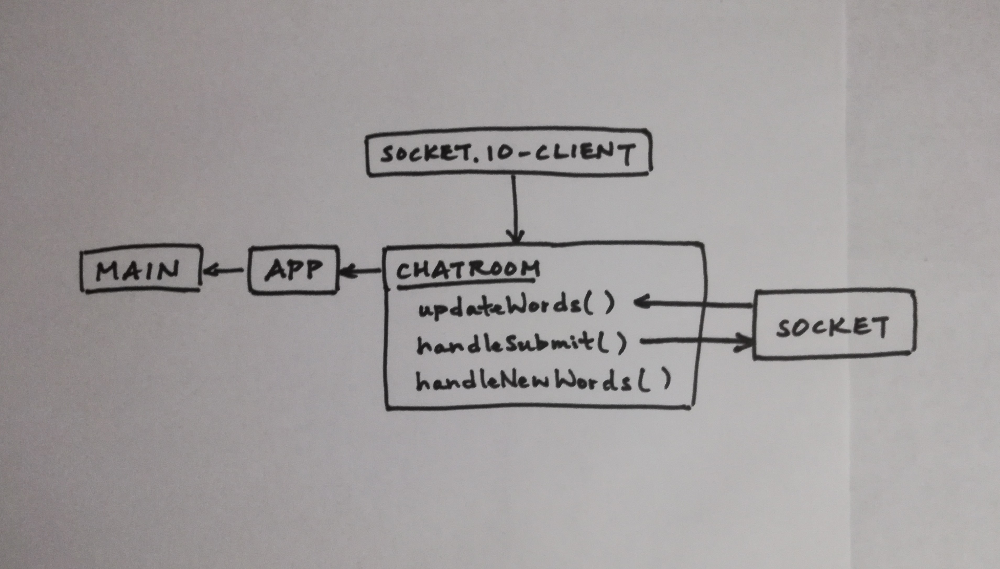

 LAB 42
=================================================

## Socket.io

### Author: Katherine Smith

### Links and Resources
* [CodeSandBox](https://codesandbox.io/s/7mpo9x0yz0)
* [yakker-server](https://github.com/ksmith10309/yakker-server)

### Modules
#### `index.js`
- Contains the Main component
  - Imports and renders the App component

#### `app.js`
- Contains the App component
  - Imports and renders the Chatroom component

#### `chatroom.js`
- Imports io from socket.io-client and connects to a socket
- Contains Chatroom component
  - Contains state for typedInput and words
  - Contains updateWords() method which updates state with incoming messages
  - Contains handleSubmit() method which emits outgoing messages and updates state with outgoing messages
  - Contains handleNewWords() method which updates state with typed input
  - Renders the chatroom

#### UML
